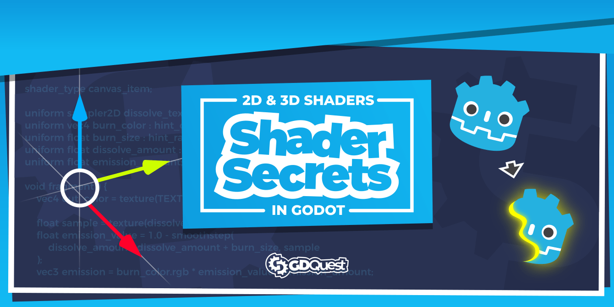
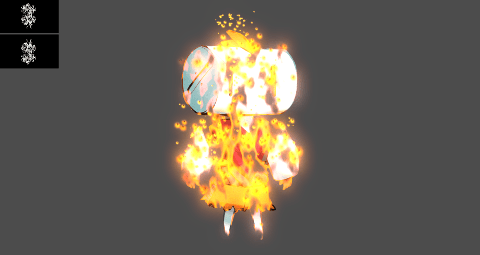
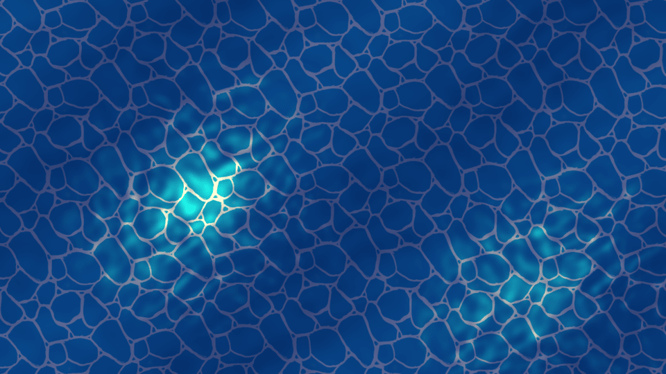

# Godot Shaders

Godot Shaders is a repository of Free shaders, part of which we made for our course [Godot Shader Secrets](https://gdquest.mavenseed.com/courses/godot-shader-secrets).

➡ Follow us on [Twitter](https://twitter.com/NathanGDQuest) and [YouTube](https://www.youtube.com/c/gdquest/) for free game creation tutorials, tips, and news! Get one of our [Godot game creation courses](https://gdquest.mavenseed.com/) to support our work on Free Software.

## The shaders

Here's a list of available shaders:

- 2D baked-in-texture glow control
- 2D glow
- Stencil mask (impossible cube)
- Advanced toon shader
- Gaussian blur
- 2D clouds: noise-based cloud shadows cast over the game world
- 2D dissolve
- 3D dissolve
- Distortion (shockwave)
- Inverted colors
- 2D outline
- 3D outline
- Pointilism
- 2D reflection
- 2D water for side-scrolling games
- 2D water in top-down view
- 2D x-ray (masking)
- Force field
- 2D palette swap
- 3D stylized fire

## How to use

You can find the shaders in the `Shaders/` directory. Most shaders come with a demo scene. All demos are in the `Demos/` directory.

The `Intro/` directory contains an intro animation to the shader pipeline, that we use in our shader course.

## Contributing

Contributors are welcome!

If you encounter a bug, please [open an issue](https://github.com/GDQuest/godot-game-harvester/issues/new).

If you want to contribute to the project, for instance by fixing a bug or adding a feature, check out our:

1. [Contributor guidelines](https://www.gdquest.com/docs/guidelines/contributing-to/gdquest-projects/).
1. [GDScript style guide](https://www.gdquest.com/docs/guidelines/best-practices/godot-gdscript/)

## Credits

Stylized fire adapted from a Unity tutorial by [@minionsart](https://twitter.com/minionsart/).

## Licenses

This project is dual-licensed:

- The source code is available under the MIT license.
- Art assets (images, audio files) are [CC-By 4.0](https://creativecommons.org/licenses/by/4.0/). You can attribute them to `GDQuest and contributors (https://www.gdquest.com/)`.
